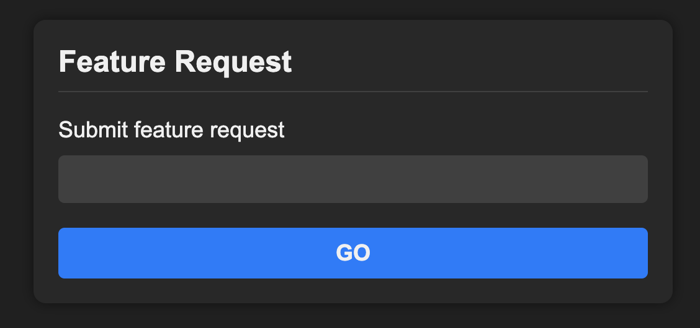
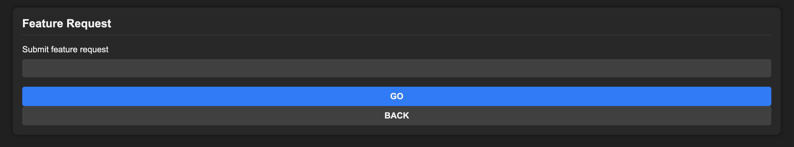

# GPT-DEV

Prototype with gpt-3 `code-davinci-edit-001` that takes feature requests
and modifies files in-place. When it's actually good enough, integrate with
github. For now, a command line tool.

## Quick start
```
$ mkdir ../secret
$ echo "${OPENAI_API_KEY}" > ../secret/openai.key
$ python3 -m venv gpt-dev-venv
$ pip3 install -r requirements.txt
```

## Usage:
```
$ python main.py \
    --repo-path=local/path/to/repo \
    --file-to-modify=server.js \
    --feature="Fix this bug: Error: SQLITE_ERROR: table suggestions already exists"
```

# Example

Created a static website with an `index.html`.



Running gpt-dev against that repository to add a new button.
```
$ python main.py \
    --repo-path=../dev-website \
    --feature="Add a button below the Go button that says 'Back'" \
    --file-to-modify=public/index.html
Indexing repository: dev-website (@/Users/elena/brian/dev-website)
INPUT FILE:
    ...
OUTPUT FILE:
    ...
```



