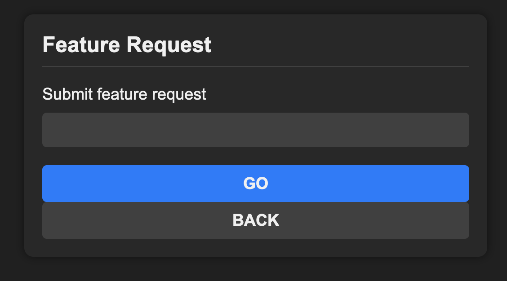

# GPT-DEV

Prototype with gpt-3 `code-davinci-edit-001` that takes feature requests
and modifies files in-place. When it's actually good enough, integrate with
github. For now, a command line tool.

## Quick start
```
$ mkdir ../secret
$ echo "${OPENAI_API_KEY}" > ../secret/openai.key
$ python3 -m venv gpt-dev-venv
$ pip3 install -r requirements.txt
```

## Usage:
```
$ python main.py \
    --repo-path=local/path/to/repo \
    --file-to-modify=server.js \
    --feature="Fix this bug: Error: SQLITE_ERROR: table suggestions already exists"
```

# Example

Created a static website with an `index.html`.


```
	<!DOCTYPE html>
	<html>

	<head>
	  <title>Feature Request</title>
	  <link rel="stylesheet" type="text/css" href="./css/style.css">
	</head>

	<body>
	  <div class="card">
	    <div class="card-header">
	      <h3 class="card-title">Feature Request</h3>
	    </div>
	    <div class="card-body">
	      <form>
	        <div class="form-group">
	          <label for="featureRequest">Submit feature request</label>
	          <input type="text" id="featureRequest" name="featureRequest" class="form-control">
	        </div>
	        <button type="submit" class="btn btn-primary">Go</button>
	      </form>
	    </div>
	  </div>
	  <script type="text/javascript" src="./js/app.js"></script>
	</body>

	</html>
```

Running gpt-dev against that repository to add a new button.
```
$ python main.py \
    --repo-path=../dev-website \
    --feature="Add a button below the Go button that says 'Back'" \
    --file-to-modify=public/index.html
Indexing repository: dev-website (@/Users/elena/brian/dev-website)
INPUT FILE:
    ...
OUTPUT FILE:
    ...
```


```
	<!DOCTYPE html>
	<html>

	<head>
	  <title>Feature Request</title>
	  <link rel="stylesheet" type="text/css" href="./css/style.css">
	</head>

	<body>
	  <div class="card">
	    <div class="card-header">
	      <h3 class="card-title">Feature Request</h3>
	    </div>
	    <div class="card-body">
	      <form>
	        <div class="form-group">
	          <label for="featureRequest">Submit feature request</label>
	          <input type="text" id="featureRequest" name="featureRequest" class="form-control">
	        </div>
	        <button type="submit" class="btn btn-primary">Go</button>
	        <button type="button" class="btn btn-success">Back</button>
	      </form>
	    </div>
	  </div>
	  <script type="text/javascript" src="./js/app.js"></script>
	</body>

	</html>
```

